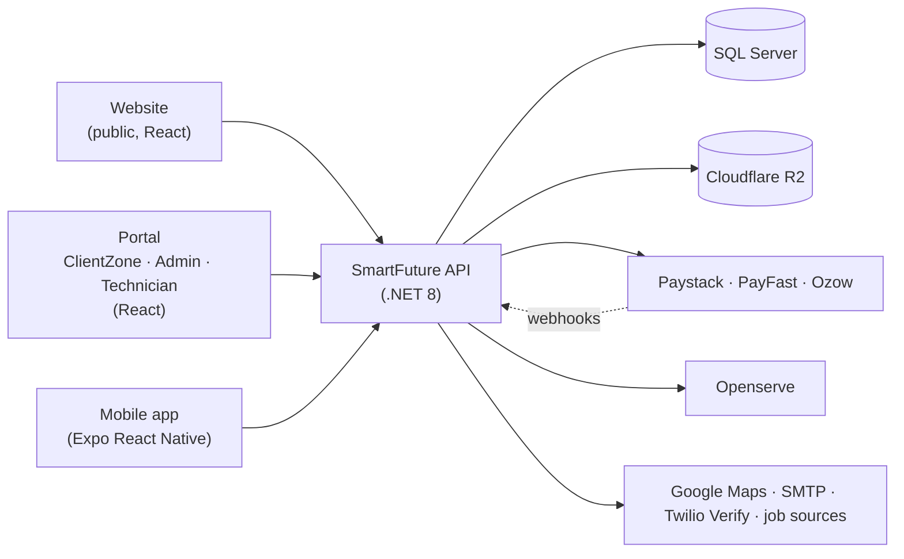

# SmartFuture API

The backend for SmartFuture, a South African internet and security service provider. It is an ASP.NET Core 8
Web API with a SQL Server database. Customers use it to check coverage, order and pay for services, and manage
their account. Staff use it to run packages, orders, installations, billing and the Openserve fibre fulfilment
process.

## What SmartFuture does

- **Customers** check coverage at their address, choose a package, pay the activation or installation fee
  online, then follow their order, installation, services, invoices and support tickets.
- **Staff** maintain the package catalogue and coverage rules, review orders, schedule installations, activate
  services, manage billing and payments, and handle support and privacy (POPIA) requests.
- **Technicians** see the installations assigned to them and update their status.

The catalogue supports `Fibre`, `LTE`, `Wireless`, `WiFi`, `Voice`, `PrepaidFibre`, `Security` and `Other`
packages. The most developed flows are **Fibre** (with Openserve coverage and fulfilment) and **Security**
(CCTV). The API also hosts a separate **Job Opportunities** module: a public job board, job listings imported
from external sources, and job-seeker accounts.

## API responsibilities

| Area | What the API does |
|---|---|
| Identity | Registration, login, refresh tokens, OTP login, password reset/change, account verification, roles |
| Catalogue | Service packages, security sub-types and variants, package images |
| Coverage | Address lookup, fibre coverage checks, admin coverage rules, coverage requests |
| Ordering | Order intents (pay first, then create the order), orders, free-activation orders, address changes |
| Services | Network accounts (a customer's active services), installations, service changes (upgrade/downgrade) |
| Billing | Invoices, payments, billing-day options, pro-rata, saved payment mandates, recurring billing |
| Payments | Paystack, PayFast and Ozow initiation, verification and webhooks |
| Fulfilment | Openserve Product Qualification and Product Ordering (behind a feature flag) |
| Operations | Admin dashboard, reports, audit log, support tickets, notifications, mobile app version rules |
| Jobs | Job board, job sources and import runs, job-seeker profiles and CV uploads |

## Solution structure

| Project | Contents |
|---|---|
| `SmartFuture.API` | Controllers, startup and DI setup (`Program.cs`, `Extensions/`), middleware, rate limiting, health checks, hosted background services |
| `SmartFuture.Application` | Business services, DTOs and interfaces grouped by feature (`Orders`, `Payments`, `Openserve`, `Coverage`, `Jobs`, …). Services query the database through `IAppDbContext`. |
| `SmartFuture.Domain` | Entities (`Order`, `ServicePackage`, `NetworkAccount`, `Invoice`, `OpenserveQualificationResult`, …) and the Identity `User` |
| `SmartFuture.Infrastructure` | `AppDbContext`, EF Core configurations and migrations, JWT tokens, SMTP senders, Cloudflare R2 storage, payment provider HTTP clients, the Openserve client, Twilio, Data Protection |
| `SmartFuture.Shared` | Enums, roles, policy names, error codes, the `Result` type, small utilities |
| `SmartFuture.Tests` | xUnit tests (see [Tests](#tests)) |

`_deploy/` holds idempotent SQL scripts generated from the migrations, so schema changes can be reviewed before
they are applied to UAT or LIVE. `Scripts/` holds one-off SQL maintenance scripts.

The projects are layered, but this is not strict Clean Architecture: the Application layer uses EF Core
directly through `IAppDbContext` instead of repositories. That keeps services simple, and lets tests run them
against a real `AppDbContext` on SQLite.

## How the API is consumed



Three applications call this API. Each sets its base URL (`VITE_API_BASE_URL` or `EXPO_PUBLIC_API_BASE_URL`)
and sends a JWT in the `Authorization: Bearer` header for protected endpoints.

- **Website** (React/Vite, public marketing site) mostly uses anonymous endpoints: public packages
  (`/api/service-packages/public`), coverage checks, coverage requests, and pre-order intents
  (`/api/public/order-intents`). An intent hands the visitor over to ClientZone with a one-time token, which
  ClientZone exchanges at `/api/auth/portal-handoff/exchange`. The website also runs the job board and
  job-seeker accounts, which use a bearer token.
- **Portal** (React/Vite) is one codebase built in admin or client mode:
  - **ClientZone** (customers): coverage, order and pay (`/api/order-intents/client/initiate-payment`, then
    the provider's redirect or inline checkout), services, installations, invoices, payments, saved payment
    methods, service changes, support and profile.
  - **Admin portal** (staff): every `admin` route — packages, customers, orders, installations, network
    accounts, billing operations, coverage rules, reports and the Openserve console.
  - **Technician screens**: `/api/technician/installations`.

  It refreshes an expired token through `/api/auth/refresh` and retries once on a 401.
- **Mobile app** (Expo React Native) is a customer app. It uses the same customer endpoints as ClientZone and
  keeps the session in `expo-secure-store`. It also uses `/api/location/*`, a server-side Google Places proxy
  for devices without Google Play Services, and `/api/app-version/mobile` for update and force-update rules.
- **External callers**: payment providers post to the webhook endpoints, and Openserve has a callback
  endpoint.

## Service packages

- A `ServicePackage` has a type and a status (`Draft`, `Active`, `Inactive`, `Archived`). It also holds
  pricing (monthly price, billing cycle, installation fee or free installation), speeds, router details,
  display order, a featured flag, an R2 image and optional features JSON.
- Security packages can also have an admin-managed **sub-type** and **variants** (for example different camera
  counts), each with its own price and installation fee.
- Admins manage packages under `/api/service-packages/admin`: create, edit, activate, deactivate, archive.
  Images are uploaded with `POST /api/uploads/service-package-image`.
- Visitors get active packages from `GET /api/service-packages/public`; signed-in customers use
  `GET /api/service-packages`.
- Fibre packages are mapped to an Openserve product (SKU, capacity and unit). Only combinations from
  Openserve's product catalogue are accepted, and the mapped speed must match the package speed.

## Ordering and service lifecycle

1. The customer checks coverage. Fibre needs coordinates; Security skips the coverage gate.
2. The client creates an **order intent** and starts a payment. The backend re-prices the package and, while
   the Openserve integration is on, re-checks Fibre eligibility before any payment starts.
3. A confirmed payment (provider webhook or server-side verify call) converts the intent into an `Order`,
   `Invoice` and `Payment`.
4. The order moves to `PendingActivation`, and a pending `NetworkAccount` (the customer's service) is created.
   An admin activates it once the line or installation is done. Automatic activation exists behind
   `ServiceActivation:RequireManualOpenserveActivation=false`.
5. Installations are scheduled, assigned to a technician and tracked through their statuses.
6. Later changes go through **service changes** (preview, request, admin processing). Admins can suspend,
   resume or terminate services.

Free-activation packages use a separate order endpoint with no payment step.

## Authentication and authorization

- **ASP.NET Core Identity** stores users (GUID keys). Passwords need 8+ characters with a digit, an
  upper-case and a lower-case letter. Accounts lock for 10 minutes after 5 failed logins.
- The API issues **JWT bearer tokens**. Access tokens last 30 minutes by default. Refresh tokens last 14
  days, are rotated on each use and can be revoked; a hosted service cleans up expired ones.
- Login is by email or phone with a password, or by OTP. Phone OTP uses Twilio Verify when it is configured;
  otherwise those endpoints answer `PROVIDER_NOT_CONFIGURED`. Email codes for password change and account
  verification are stored hashed.
- **Roles**: `SuperAdmin`, `Admin`, `Agent`, `Technician`, `Support`, `Customer`, `JobSubscriber`.
- **Policies**: `RequireAdmin` (Admin or SuperAdmin), `RequireCustomer`, `RequireTechnician`,
  `RequireJobSubscriber`, and `RequireActiveUser`, which needs an `account_status=Active` claim so suspended
  accounts are blocked.
- Admin routes sit under `admin` paths or on admin-only controllers. Customers reach only their own data,
  through `mine` routes.
- **Rate limits** (fixed window per IP) apply to authentication, coverage checks and inbound webhooks.
- `SecurityHeadersMiddleware` sets response security headers. `ExceptionHandlingMiddleware` returns a
  consistent JSON error envelope and hides exception details unless `Diagnostics:ExposeExceptionDetails` is on.

## Database and persistence

- SQL Server through **EF Core 8** (`AppDbContext`), with connection retry enabled. The connection string is
  chosen by environment: `ConnectionStrings:UatConnection` for UAT, and `ConnectionStrings:LiveConnection`
  for Production and Development.
- Migrations live in `SmartFuture.Infrastructure`: older ones in `Migrations/`, newer ones in
  `Data/Migrations/`. The model snapshot stays in `Migrations/`.
- With `Database:ApplyMigrationsOnStartup=true` the API applies pending migrations at startup, then seeds the
  roles. It can also seed a first super admin (`SeedSuperAdmin:*`) and starter packages (`PackageSeed:*`).
- Money and history have their own tables: invoices, payments, payment initiations, webhook inbox and logs,
  billing run logs, audit logs and Openserve integration logs. Each Openserve qualification is stored as an
  evidence row with its products, so admins can see why an order is or isn't eligible without raw logs.
- Secrets that must survive restarts (the Openserve API key and saved payment authorisations) are encrypted
  with **ASP.NET Core Data Protection**. The key ring is persisted to `App_Data/DataProtection-Keys`
  (`DataProtection:KeysPath` overrides it).

## Payments and billing

- **Paystack**, **PayFast** and **Ozow** share one initiation and notification flow; each is switched on per
  environment.
  - Paystack: transaction initialise and verify, webhooks checked against the `x-paystack-signature` HMAC,
    `charge_authorization` for saved cards, and admin reconciliation.
  - PayFast: ITN notifications checked by signature (with passphrase), card tokenisation and ad-hoc charges.
  - Ozow: hash-checked notifications and a transaction-status lookup.
- UAT can charge a small test amount instead of the real price (`*:UseTestAmountOverride`). PayFast and Ozow
  ignore it in Production; Paystack ignores it with a live key unless `Paystack:AllowLiveTestAmountOverride`
  is also set.
- **Billing**: numbered invoices and payments, billing days that customers pick from admin-managed options,
  pro-rata (Security charges it at checkout, Fibre from activation), saved payment mandates and debit-order
  mandate requests.
- A daily **recurring billing** worker generates due invoices, charges saved mandates, retries failures and
  reports accounts past their grace period. Every stage sits behind `AutoBilling:*` flags, all off by default;
  the suspension stage only reports.

## Coverage and Openserve

**Coverage check** (`POST /api/coverage/check`, anonymous, rate-limited):
- Admin **coverage map rules** (Include or Exclude, on suburb, city, postal code and similar) are applied
  first.
- With the Openserve integration off, the API then calls Openserve's **public GIS coverage endpoint** and
  matches packages by line speed. This is the long-standing path.
- With the integration on, **authenticated Product Qualification** decides Fibre eligibility instead.
- When the client sends only text, the address is geocoded with Google first.

**Openserve fulfilment** (`OpenserveFulfilment:*`, off in `appsettings.json`; admins can also configure it at
runtime) is implemented and tested against Openserve's **staging** environment:
- Address verification lists the Openserve address records near the customer's pin. They are matched on
  street number and street, never by nearest distance alone.
- When nothing matches, the customer (with an explicit confirmation) or an admin picks the record that is
  their property. This Openserve "service premises" is stored separately from the installation address.
- The chosen record is qualified by its AMID (Openserve address ID): Fibre, products on offer, and the
  building/unit for multi-unit addresses.
- Product Orders are sent after payment. A timeout counts as "outcome unknown" and is never resent
  automatically.
- A recovery worker retries only safe failures, and a reconciliation worker polls order status.
- An admin console covers configuration, readiness checks, logs, package mappings, per-order fulfilment and
  cancellation.

Not implemented: ownership change, cease, speed/product change and suspend/resume. The callback endpoint
exists, but polling is the confirmed status path.

## Provisioning (RADIUS / MikroTik)

**Prepared for, not implemented.** Network accounts have provisioning actions (activate, suspend, resume,
change package, terminate, disconnect, session status), provisioning events, and RADIUS profiles linked to
packages. All actions go through `INetworkProvisioner`, whose only implementations are a NoOp and a logging
stub. `Provisioning:Enabled=false` and `Provisioning:Mode=NoOp` are the defaults; the RADIUS, MikroTik and
Hybrid modes are reserved.

## Security services

`Security` is its own package type with admin-managed sub-types and variants, listed to visitors through the
same public package endpoint.
- Saving a Security package requires an image, and its provisioning fields (`RequiresProvisioning`,
  provisioning type, RADIUS profile) are forced off.
- Orders skip the coverage check and don't need coordinates. They go through the same order, invoice and
  payment pipeline as Fibre, charge pro-rata at checkout, and wait for an admin to activate the service.

## Media storage

Files go to **Cloudflare R2** through its S3-compatible API (`AWSSDK.S3`), behind `IFileStorageService`.
Package images are uploaded by admins; the database stores the public URL (built from `R2:PublicBaseUrl`) and
the storage key. Job-seeker CVs and cover letters are private; admins view them through short-lived pre-signed
URLs.

## Notifications

- **Implemented**: email over **SMTP** from named mailboxes (`NoReply`, `Support`, `Accounts`, `Payments`,
  `Security`) with HTML and text templates, for account, order, payment, billing and Openserve events. There is
  also a single-mailbox test mode for UAT and an admin endpoint for sending notifications.
- **Planned**: SMS and WhatsApp exist only as interfaces with "not configured" stubs. Twilio is used only for
  phone OTP (Verify).

## Background services

Hosted services in `SmartFuture.API/HostedServices`, each checking its own flag first: expired refresh-token
cleanup, recurring billing (off by default), job import (toggled in the database), Openserve order
reconciliation and Openserve submission recovery.

## External integrations

| Integration | Used for |
|---|---|
| Paystack, PayFast, Ozow | Card and EFT payments, webhooks, saved-card charges |
| Openserve | Public coverage lookup, plus the authenticated Product Qualification and Product Ordering APIs |
| Google Maps Platform | Geocoding, plus a Places autocomplete/details proxy for the mobile app |
| Cloudflare R2 | Package images and private job-seeker documents |
| SMTP mail server | Transactional email |
| Twilio Verify | Phone OTP, only when configured |
| Job sources | HTML pages, RSS feeds or JSON APIs that admins register for job import |

## API documentation

Swagger (Swashbuckle) is on in **Development** and off elsewhere unless `Swagger:Enabled=true`. Locally it is
at `https://localhost:7133/swagger` (or `http://localhost:5091/swagger`). It lists every controller and has a
**Bearer** authorise button: paste an access token from `POST /api/auth/login` to call protected endpoints.

## Environments

| Environment | `ASPNETCORE_ENVIRONMENT` | Database key | Host |
|---|---|---|---|
| Development | `Development` | `ConnectionStrings:LiveConnection` | localhost |
| UAT | `UAT` | `ConnectionStrings:UatConnection` | `https://uatapi.smartfuture.co.za` |
| Production | `Production` | `ConnectionStrings:LiveConnection` | `https://api.smartfuture.co.za` |

- `appsettings.json` holds defaults with empty secret slots; `appsettings.Production.json` only holds mobile app
  version rules.
- Real values are environment variables on the host, in `Section__Key` form (for example `JwtSettings__Key`).
  A local `appsettings.Development.json` is gitignored.
- `SmartFuture.API/DEPLOYMENT_CONFIG.md` lists the deployment settings. The API is deployed to IIS with Web Deploy.
- `GET /health` is a liveness check; `GET /health/ready` also checks the database.

## Running locally

Prerequisites: the .NET 8 SDK and a SQL Server instance (local SQL Server or Express is fine).

```bash
dotnet restore SmartFuture.sln
cd SmartFuture.API && dotnet tool restore && cd ..   # dotnet-ef from the local tool manifest
```

Configure the API with environment variables or a local `SmartFuture.API/appsettings.Development.json`
(gitignored). The minimum is:

```text
ASPNETCORE_ENVIRONMENT=Development
ConnectionStrings__LiveConnection=<your local SQL Server connection string>
JwtSettings__Key=<random string, 32+ characters>
```

The startup check rejects the placeholder JWT key in `appsettings.json`.
- Optional first admin: `SeedSuperAdmin__Enabled`, `SeedSuperAdmin__Email`, `SeedSuperAdmin__Password`.
- Integrations stay off until their sections are filled in: `CoverageSettings__GoogleMaps__ApiKey`, `R2__*`,
  `Paystack__*`, `PayFast__*`, `Ozow__*`, `EmailProviders__Senders__*`, `Twilio__*`, `OpenserveFulfilment__*`.

Migrations run at startup (`Database:ApplyMigrationsOnStartup` is `true` in `appsettings.json`), or you can
apply them manually. Then run the API:

```bash
dotnet ef database update --project SmartFuture.Infrastructure --startup-project SmartFuture.API
dotnet run --project SmartFuture.API --launch-profile https
# then open https://localhost:7133/swagger
```

New migrations go in `Data/Migrations`:

```bash
dotnet ef migrations add <Name> --project SmartFuture.Infrastructure --startup-project SmartFuture.API --output-dir Data/Migrations
```

## Tests

`SmartFuture.Tests` has about 960 xUnit tests, using Moq and FluentAssertions. Most run business services
against a real `AppDbContext` on in-memory SQLite (`SqliteTestDbFixture`). They cover payment webhooks and
settlement for each provider, recurring billing and pro-rata, order intents and checkout gates, Openserve
qualification, address matching, submission safety and recovery, coverage checks and rate limiting, Security
packages and the Jobs module. Payment providers and Openserve are mocked; the tests never call them.

```bash
dotnet test SmartFuture.Tests/SmartFuture.Tests.csproj
```

## Development ownership

I was responsible for the backend/API engineering in this repository while working on SmartFuture.

## Notes and trade-offs

- **Flags around risky integrations.** Payments, auto-billing, Openserve fulfilment and provisioning each sit
  behind configuration flags with safe defaults, so code could be deployed and tested on UAT before a provider
  was approved for live use.
- **Manual activation by default.** Openserve activation and RADIUS provisioning are not automated end to end,
  so a paid order waits for an admin to activate the service.
- **"Outcome unknown" is never resent.** Openserve has no idempotency key, so a Product Order that timed out
  may already exist. An admin must confirm before it is retried.
- **"Unknown" is not "unavailable".** An Openserve record that isn't the customer's never produces a "no Fibre
  at your address" answer. Fibre is reported as unknown until the premises is established.
- **Connection key naming.** Development and Production share the `LiveConnection` key, so keep local values
  pointing at a local database.
- **No CI pipeline yet.** `.github/workflows` is empty; tests are run locally before deployment.
- **Older notes.** Some Markdown notes in the API project, such as
  `CLIENT_SERVICES_AND_INSTALLATION_LIFECYCLE.md`, describe earlier phases. The code is the reference for
  current behaviour.
